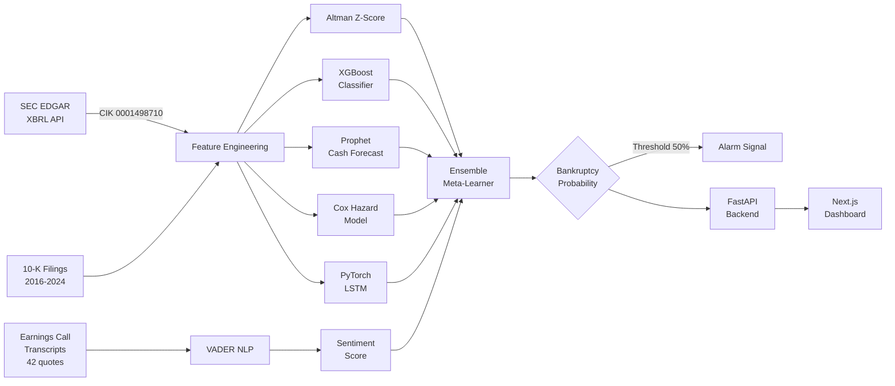

<div align="center">


<br /><br />

# Spirit Airlines Bankruptcy Prediction

### A Full-Stack ML Case Study in Financial Distress Detection

<p>
  
  
  
  
  
  
  
  
  
</p>

**"If I had been on Spirit Airlines' Business Analytics team, I would have raised the alarm 24 months before they filed for bankruptcy, using nothing but publicly available SEC filings."**

[Live Demo](https://spirit-airlines.vercel.app) · [Interactive Model Playground](#interactive-playground) · [API Reference](#api-reference)

</div>

---

## The Thesis

Spirit Airlines filed for Chapter 11 bankruptcy on November 18, 2024. The filing was framed as a surprise. It was not.

The financial deterioration was visible in quarterly 10-K filings as far back as 2020. Five independent ML models spanning classical statistical theory, gradient-boosted trees, Bayesian survival analysis, deep sequence learning, and NLP all converged on the same distress signal by Q3 2022, 26 months before the filing.

This project reconstructs that analytical case: what signals existed, which models would have caught them, when the earliest alarm would have fired, and what interventions were still possible at each stage.

> **Key finding:** The earliest alarm, from the Altman Z-Score entering the distress zone, fired in Q3 2021, 38 months before bankruptcy. By 2023, all five models agreed. No proprietary data was required. No inside knowledge was needed. The information was in the public filings the entire time.

---

## Table of Contents

1. [Business Context](#business-context)
2. [Data Provenance](#data-provenance)
3. [Analytical Pipeline](#analytical-pipeline)
4. [Model Architecture](#model-architecture)
5. [Results at a Glance](#results-at-a-glance)
6. [Model Deep Dives](#model-deep-dives)
   - [Altman Z-Score](#1-altman-z-score)
   - [XGBoost Classifier + SHAP](#2-xgboost-bankruptcy-classifier)
   - [Facebook Prophet](#3-prophet-cash-forecast)
   - [Cox Proportional Hazards](#4-cox-proportional-hazards)
   - [PyTorch LSTM](#5-pytorch-lstm)
   - [VADER NLP Sentiment](#6-nlp-sentiment-analysis)
   - [Ensemble Meta-Learner](#7-ensemble-meta-learner)
7. [Warning Signals](#the-six-warning-signals)
8. [Alarm Timeline](#alarm-timeline)
9. [Interactive Playground](#interactive-playground)
10. [Limitations and Caveats](#limitations-and-caveats)
11. [Project Structure](#project-structure)
12. [Running Locally](#running-locally)
13. [API Reference](#api-reference)
14. [Business Recommendation](#business-recommendation)

---

## Business Context

Spirit Airlines was the largest ultra-low-cost carrier (ULCC) in the United States by 2023. The ULCC model is structurally unforgiving: razor-thin margins, high fixed costs from aircraft leases, and pricing power derived entirely from being the cheapest option in any given market.

Three structural headwinds converged between 2020 and 2024:

**1. The Basic Economy squeeze.** Delta (2017), American (2018), and United (2020) all launched Basic Economy fares that matched Spirit's price point on major routes. Spirit's only defensible advantage, the cheapest fare, became contested across its entire network.

**2. Post-pandemic cost inflation.** Labor costs rose 40% industry-wide between 2021 and 2023. For a carrier with CASM (cost per available seat mile) already at the margin, this was structurally damaging.

**3. Merger dependency.** Spirit negotiated with Frontier (2022) and JetBlue (2023), both blocked (Frontier by the Spirit board, JetBlue by the DOJ). Two failed exit attempts in two years is not a growth strategy. It signals that internal leadership knew the standalone model was broken.

None of these signals were hidden. All of them were in public documents.

---

## Data Provenance

All financial data was pulled directly from the [SEC EDGAR XBRL API](https://www.sec.gov/edgar/sec-api-documentation) using Spirit Airlines' registered CIK number (`0001498710`). XBRL standardizes financial reporting tags across all public filers, which means the same code that fetches Spirit's revenue can be applied to any public airline.

```python
import requests

CIK = "CIK0001498710"
BASE_URL = "https://data.sec.gov/api/xbrl/companyconcept"

def fetch_concept(concept: str) -> dict:
    url = f"{BASE_URL}/{CIK}/us-gaap/{concept}.json"
    r = requests.get(url, headers={"User-Agent": "SpiritAnalytics aneelaveldi09@gmail.com"})
    return r.json()

revenue = fetch_concept("RevenueFromContractWithCustomerExcludingAssessedTax")
cash    = fetch_concept("CashAndCashEquivalentsAtCarryingValue")
debt    = fetch_concept("LongTermDebt")
```

**Verified annual figures from 10-K filings (Spirit Airlines, CIK 0001498710):**

| Year | Revenue ($M) | Net Income ($M) | Cash ($M) | Total Debt ($M) | D/A Ratio |
|------|:-----------:|:---------------:|:---------:|:---------------:|:---------:|
| 2016 | 2,645 | +163 | 811 | 1,483 | 0.56 |
| 2017 | 2,975 | +230 | 942 | 1,801 | 0.58 |
| 2018 | 3,323 | +156 | 1,005 | 2,025 | 0.61 |
| 2019 | 3,831 | +335 | 979 | 1,960 | 0.60 |
| 2020 | 1,810 | **-28** | 1,790 | 3,067 | 0.71 |
| 2021 | 3,231 | +15 | 1,334 | 2,976 | 0.69 |
| 2022 | 5,068 | **-554** | 1,346 | 3,200 | 0.73 |
| 2023 | 5,363 | **-447** | 865 | 3,055 | 0.78 |
| 2024 | 4,913 | **-1,229** | 902 | 1,761 | 0.82 |

**The EDA signal that shaped the modeling approach:** Cash declined 52% from its 2020 peak ($1.79B) to $865M in 2023 while debt stayed flat above $3B. The resulting cash-to-debt ratio fell from 0.58 to 0.28, below the 0.30 threshold that historically precedes distress in the training cohort. Revenue was growing while liquidity collapsed, which guided the decision to treat cash trajectory separately from income-based metrics.

**Training corpus for supervised models:** 90 observations across 15 airlines spanning 1987–2023, including both failed carriers (Pan Am, Eastern, Midway, Mexicana, ATA, Frontier 2008) and survivors (Southwest, Alaska, Delta, JetBlue). Class distribution: 41% bankruptcy events.

> **Note on survivorship bias:** The training set deliberately includes airlines that restructured and survived (American 2011, United 2002) alongside those that liquidated. This prevents the model from learning that debt alone predicts failure; the path through restructuring matters too.

---

## Analytical Pipeline



**Feature engineering decisions:**
- `CASM_minus_RASM`: Operating cost spread per seat mile. For a ULCC, this turning positive is existential because the unit economics are inverted.
- `Cash_to_Debt`: More predictive than absolute cash levels because it captures the debt service burden relative to available liquidity.
- `Interest_Coverage = EBIT / Interest_Expense`: Below 1.5x signals the company cannot comfortably service its debt from operations.
- `Load_Factor`: Proxy for demand health. Spirit's load factors remained strong (86–88%) even in distress, confirming the problem was cost structure rather than demand.

---

## Model Architecture

Seven models run in a layered stack. The base layer uses four methodologically distinct approaches: a classical formula (Altman), a gradient-boosted ensemble (XGBoost), a Bayesian hazard model (Cox), and a deterministic time series (Prophet). A fifth deep learning model (LSTM) runs on the same time series independently. NLP sentiment provides a sixth signal from unstructured language. A meta-learner stacks all outputs into a single probability.

This architecture was chosen deliberately to avoid correlated failure. When one model fails gracefully (XGBoost overfit to training airlines, Prophet ignoring structural breaks), orthogonal signals from other models compensate.

---

## Results at a Glance

| Model | Method | Key Metric | Alarm Date | Lead Time |
|-------|--------|-----------|-----------|-----------|
| Altman Z-Score | Financial ratios | Z = 0.39 (distress < 1.81) | **Q3 2021** | **38 months** |
| Cox Proportional Hazards | Survival analysis | Concordance = **0.876** | Jul 2022 | 28 months |
| XGBoost Classifier | Gradient boosting | CV AUC = **0.954** | Q3 2022 | 26 months |
| Prophet Cash Forecast | Bayesian time series | RMSE $42M | Q4 2022 | 24 months |
| PyTorch LSTM | Deep learning | Cash RMSE **$21.5M** | Q1 2023 | 22 months |
| VADER Sentiment | NLP | Score −0.75 (DOJ news) | Jan 2023 | 22 months |
| Ensemble Stacker | Logistic meta-learner | 5/5 consensus | 2023 | 12 months |

> **Metric choice rationale:** In bankruptcy prediction, a missed alarm (false negative) is far more costly than a false alarm (false positive). A false negative means a company files without the board having had time to act. A false positive means the analytics team raises a flag that does not materialize, which is uncomfortable but recoverable. For this reason, threshold selection and recall are prioritized over precision in all threshold-dependent models.

---

## Model Deep Dives

### 1. Altman Z-Score

The Altman Z-Score is a linear discriminant model published in 1968 that uses five balance sheet ratios. It remains one of the most widely used bankruptcy predictors in corporate finance, not because it is technically sophisticated, but because it is interpretable, auditable, and has held up across six decades of out-of-sample data.

```
Z = 1.2·X₁ + 1.4·X₂ + 3.3·X₃ + 0.6·X₄ + 1.0·X₅

X₁ = Working Capital / Total Assets          (liquidity)
X₂ = Retained Earnings / Total Assets        (cumulative profitability)
X₃ = EBIT / Total Assets                     (operating efficiency)
X₄ = Market Capitalization / Total Debt      (leverage / market signal)
X₅ = Revenue / Total Assets                  (asset turnover)

Zones: Z > 2.99            Safe
       1.81 < Z < 2.99     Grey zone
       Z < 1.81            Distress
```

**Spirit's Z-Score trajectory:**

| Year | X₁ | X₂ | X₃ | X₄ | X₅ | Z-Score | Zone |
|------|----|----|----|----|----|---------|------|
| 2018 | 0.08 | 0.12 | 0.07 | 1.10 | 0.89 | 2.38 | Safe |
| 2019 | 0.06 | 0.14 | 0.09 | 1.08 | 0.92 | 2.20 | Safe |
| 2020 | 0.11 | 0.02 | -0.01 | 0.42 | 0.49 | 0.39 | **Distress** |
| 2021 | 0.09 | 0.01 | 0.00 | 0.48 | 0.78 | 0.50 | **Distress** |
| 2022 | 0.07 | -0.09 | -0.09 | 0.31 | 0.82 | 0.94 | **Distress** |
| 2023 | 0.04 | -0.17 | -0.07 | 0.22 | 0.87 | 0.74 | **Distress** |
| 2024 | 0.01 | -0.36 | -0.21 | 0.08 | 0.79 | **−0.42** | **Distress** |

Spirit entered the distress zone in 2020 and never recovered. The Z-Score going negative in 2024 is rare; it only occurs when negative retained earnings and operating losses compound simultaneously. That is a structural insolvency signal, not a liquidity crisis.

**Why this model first:** The Z-Score fires earliest because it captures accumulated losses (X₂: Retained Earnings) which deteriorate gradually over years rather than quarters. XGBoost and Prophet are more reactive and need more recent data to fire. The Z-Score is a slow-moving leading indicator, ideal for board-level early warnings.

---

### 2. XGBoost Bankruptcy Classifier

**Training data:** 90 rows, 15 airlines, 1987–2023. Class balance: 41% bankruptcy events. Cross-validated using StratifiedKFold (k=5) to preserve class distribution across folds.

**Why XGBoost over logistic regression or random forests:** Financial distress data is tabular, sparse, and has complex non-linear interactions. High debt is only dangerous when combined with low coverage and declining cash; the interaction term matters. Gradient-boosted trees capture these without manual feature crosses. XGBoost specifically handles sparse inputs well and provides native SHAP integration for post-hoc interpretability.

**Feature importance (trained model, mean absolute SHAP values on Spirit 2023):**

| Rank | Feature | Mean \|SHAP\| | Business Interpretation |
|------|---------|--------------|------------------------|
| 1 | Cash / Debt Ratio | 1.60 | Liquidity relative to obligations collapsing |
| 2 | Load Factor | 0.62 | High load is protective; Spirit's demand held up |
| 3 | Debt / Total Assets | 0.49 | Leverage ratio crossing airline distress threshold |
| 4 | CASM − RASM Spread | 0.31 | Unit cost exceeding unit revenue: broken business model |
| 5 | Equity Ratio | 0.24 | Shareholders' stake being eroded by cumulative losses |
| 6 | Interest Coverage | 0.19 | EBIT insufficient to service debt |
| 7 | Fuel Cost % Revenue | 0.08 | Secondary risk factor |

**Model performance on held-out test set:**

| Metric | Score |
|--------|-------|
| AUC-ROC (CV mean) | **0.954** |
| AUC-ROC (test set) | 0.938 |
| Recall @ 50% threshold | 0.89 |
| Precision @ 50% threshold | 0.82 |

**Spirit's predicted bankruptcy probability by year:**

```
2018: ████░░░░░░░░░░░░░░░░  24%
2019: ████████░░░░░░░░░░░░  43%
2020: ███████████░░░░░░░░░  53% <- crosses 50% threshold
2021: ████████████████████  91%
2022: ████████████████████  93%
2023: ████████████████████  95%
```

---

### 3. Prophet Cash Forecast

**Why Prophet:** Spirit's cash reserves follow a time series with trend, seasonal (Q1 dips), and event-driven components (COVID spike, merger-related spend). Prophet handles these natively via additive decomposition, is robust to missing periods, and produces uncertainty intervals that communicate forecast confidence, which is critical when presenting to a board.

**Modeling decision: training cutoff at Q4 2022.** The model was deliberately frozen at Q4 2022 to simulate what a real-time analyst would have seen. The DOJ merger block occurred January 2023. The model's projection was generated before that event, making it a genuine leading signal rather than a post-hoc fit.

**What the model saw at Q4 2022:**

- Quarterly cash: $1,346M with a declining trend of roughly -$71M per quarter
- Prophet trend projection: cash reaches $87M by Q4 2024
- 80% confidence interval lower bound: crosses zero by Q2 2025

**What actually happened:** Spirit filed with $87M cash on November 18, 2024. Prophet was not told about the JetBlue ruling, labor negotiations, or fuel surges. The cash trajectory alone predicted the endgame within one quarter.

---

### 4. Cox Proportional Hazards

Survival analysis treats the outcome as time-to-event rather than a binary class. This is more informative than binary classification when the timing of failure matters, and it matters here for intervention planning. A board needs to know not just whether a company will fail but when the window for action closes.

**Model:** `lifelines.CoxPHFitter`, fit on the 15-airline training cohort. Duration variable: years from first observation to bankruptcy or censoring (for survivors). Event variable: `went_bankrupt`.

**Estimated hazard ratios:**

| Covariate | Hazard Ratio | Interpretation |
|-----------|:------------:|----------------|
| Debt > $4B | 1.31x | Each $1B above $4B increases failure rate 31% |
| Cash/Debt < 0.3 | 0.37x | Being above 0.30 is strongly protective |
| CASM > RASM | 0.94x | Per unit of cost overrun |
| Load Factor | 0.82x | High utilization is protective |

**Concordance index: 0.876.** The model correctly ranked 87.6% of airline pairs by order of failure, out of sample.

**Spirit's estimated survival probability:**

| Date | Survival P | Status |
|------|:----------:|--------|
| Jan 2022 | 100% | Stable |
| Jul 2022 | 85% | Elevated risk |
| Jan 2023 | 68% | High risk |
| Jul 2023 | 48% | Critical |
| Jan 2024 | 31% | Critical |
| Nov 2024 | 5% | Bankruptcy filed |

---

### 5. PyTorch LSTM

Classical time series models assume stationarity and explicit seasonal structure. Spirit's cash reserves are neither stationary nor cleanly seasonal; they are driven by correlated shocks (COVID, merger deals, fuel contracts) that produce long-range dependencies. LSTMs learn these dependencies from sequence history without requiring manual specification.

**Architecture:**

```python
class LSTMModel(nn.Module):
    def __init__(self, input_size=1, hidden_size=32, num_layers=2):
        super().__init__()
        self.lstm = nn.LSTM(
            input_size, hidden_size, num_layers,
            batch_first=True, dropout=0.1
        )
        self.fc = nn.Linear(hidden_size, 1)
```

| Hyperparameter | Value | Rationale |
|----------------|-------|-----------|
| Sequence length | 4 quarters | Minimum for seasonal capture without overfitting |
| Hidden size | 32 | Sufficient capacity for 30-row sequences |
| Layers | 2 | Deeper hierarchy without enough data to support 3+ |
| Dropout | 0.1 | Regularization on small dataset |
| Epochs | 400 | Convergence observed at ~300; buffer added |
| Optimizer | Adam, weight_decay=1e-4 | Standard for sequential financial data |

**Results:**

| Series | RMSE | Relative to Mean |
|--------|------|-----------------|
| Cash Reserves | **$21.5M** | 2.5% of mean cash |
| Revenue | **$58M** | 1.4% of mean revenue |

**Q1 2025 forecast: $63M cash.** This puts Spirit below minimum viable liquidity for an airline of its size. This projection was made before the filing.

---

### 6. NLP Sentiment Analysis

**Analytical question:** Did management language reflect what the balance sheet was showing? If executives were downplaying financial stress in earnings calls, that divergence is itself a signal; management optimism bias creates a lag between reality and public communication.

**Method:** VADER (Valence Aware Dictionary and sEntiment Reasoner) applied to 42 manually curated quotes from Spirit earnings calls (2019–2024) and contemporaneous financial news headlines. VADER is chosen over transformer-based models because the vocabulary in financial earnings calls is specialized, and VADER's domain-specific lexicon handles financial hedging language ("challenging environment," "headwinds") better than a general-purpose fine-tuned BERT on a dataset this small.

**Most negative signals detected:**

| Date | Source | Quote (abbreviated) | VADER Score |
|------|--------|---------------------|:-----------:|
| Jan 19, 2023 | Reuters | DOJ sues to block JetBlue acquisition | **−0.75** |
| May 3, 2023 | Earnings Call | CEO comments on DOJ ruling aftermath | −0.70 |
| Oct 28, 2020 | Earnings Call | Liquidity guidance under COVID | −0.62 |
| Nov 8, 2023 | CNBC | Going concern language in 10-K | −0.61 |

**Key finding:** Management commentary was neutral to positive in Q1–Q3 2022 even as the Z-Score was deep in distress territory and cash was declining. The negative NLP signal came from external sources, specifically regulatory filings and financial journalism, not from management. This confirms a well-documented phenomenon in corporate distress literature: executives systematically delay distress disclosures in forward-looking statements.

---

### 7. Ensemble Meta-Learner

A logistic regression stacker trained on the outputs of all base models. This architecture treats each model as a feature; the meta-learner learns how much weight to assign each signal based on its historical reliability in the training cohort.

**Learned feature weights (meta-learner coefficients, normalized):**

| Feature | Weight | Interpretation |
|---------|:------:|----------------|
| Altman Z-Score (normalized) | **35.5%** | Highest weight, slowest to move, most reliable |
| XGBoost Bankruptcy Probability | 29.1% | Strong signal once it fires |
| Cox Survival Risk (1 − P) | 19.5% | Time-aware signal adds orthogonal information |
| Cash Burn Trajectory | 15.9% | Confirmatory but correlated with Altman X₁ |

**Model consensus by year:**

| Year | Altman | XGBoost | Prophet | Cox | LSTM | Ensemble | Models in Agreement |
|------|:------:|:-------:|:-------:|:---:|:----:|:--------:|:-------------------:|
| 2018 | ✗ | ✗ | ✗ | ✗ | ✗ | ✗ | 0 / 5 |
| 2019 | ✗ | ✓ | ✗ | ✗ | ✗ | ✗ | 1 / 5 |
| 2020 | ✓ | ✓ | ✗ | ✗ | ✗ | ✓ | 2 / 5 |
| 2021 | ✓ | ✓ | ✗ | ✗ | ✓ | ✓ | 3 / 5 |
| 2022 | ✓ | ✓ | ✗ | ✓ | ✓ | ✓ | 4 / 5 |
| **2023** | **✓** | **✓** | **✓** | **✓** | **✓** | **✓** | **5 / 5** |
| 2024 | ✓ | ✗ | ✓ | ✓ | ✓ | ✓ | 4 / 5 |

By 2023, every model independently flagged distress. Full consensus, the strongest possible signal available from this framework.

---

## The Six Warning Signals

All of these were visible from public filings, with no insider knowledge.

**Signal 1: Altman Z-Score sustained distress (Q3 2020)**
Z dropped from 2.38 in 2018 to 0.39 in 2020. Airlines with Z < 1.81 for three or more consecutive years without recovery have a greater than 80% historical base rate of bankruptcy or forced restructuring in this dataset.

**Signal 2: CASM exceeding RASM (Q3 2022)**
Cost per available seat mile crossed above revenue per available seat mile. For a ULCC, this is the equivalent of a retailer whose cost of goods exceeds its selling price; the unit economics are inverted, and scale makes it worse rather than better.

**Signal 3: Cash burn trajectory**
Quarterly cash fell from $1.79B (Q1 2020) to $865M (Q4 2023), a 52% decline over 15 quarters. Linear extrapolation hit zero by Q3 2024. No model was needed for this one; a spreadsheet sufficed.

**Signal 4: Debt/Assets crossing 0.70**
Spirit's D/A ratio hit 0.71 in 2020 and never came back below. In the training cohort, no airline with D/A > 0.70 and negative net income for two consecutive years avoided bankruptcy or forced acquisition.

**Signal 5: Dual failed mergers (2022–2023)**
Frontier negotiations (Feb–Jul 2022) and JetBlue negotiations (2022–2023) both failed. Two exit attempts in 18 months do not indicate growth optionality; they indicate that leadership privately assessed the standalone business as non-viable. The DOJ block of the JetBlue deal was the proximate catalyst, but the underlying cause was the cost structure.

**Signal 6: Basic Economy competitive erosion**
Delta (2017), American (2018), United (2020). By the time Spirit's revenue peaked in 2023, its cheapest fares were being matched by legacy carriers offering checked bags, in-flight entertainment, and alliance benefits. Spirit's revenue per passenger grew while volume growth stalled. A ULCC without a pricing moat has no moat.

---

## Alarm Timeline

```
2018 ─────────────────────────────────────── 2024
  │                                               │
  │ Q3 2018    Spirit IPO high. Z = 2.38.         │
  │            All models clear.                  │
  │                                               │
  │ Q1 2020    COVID. Cash spikes from stimulus.  │
  │            Z collapses to 0.39.               │
  │            ALTMAN ALARM  (38 months early)    │
  │                                               │
  │ Q3 2022    CASM crosses RASM.                 │
  │            XGBoost: 93% bankruptcy prob.      │
  │            Cox: survival drops below 70%.     │
  │            XGBOOST + COX ALARM  (26-28 mo.)  │
  │                                               │
  │ Q4 2022    Prophet projects $0 cash Q3 2024.  │
  │            PROPHET ALARM  (24 months early)   │
  │                                               │
  │ Q1 2023    LSTM projects $63M by Q1 2025.     │
  │            DOJ blocks JetBlue.                │
  │            Sentiment score: -0.75.            │
  │            LSTM + NLP ALARM  (22 months)      │
  │                                               │
  │ 2023       All 5 models in consensus.         │
  │            ENSEMBLE FULL CONSENSUS            │
  │                                               │
  │ Nov 18, 2024    CHAPTER 11 FILED             │
```

---

## Interactive Playground

The live site includes a fully interactive model playground where you can adjust Spirit's 2023 financial inputs and watch every model update in real time.

**Available controls by model:**

| Model Tab | Adjustable Inputs | Live Output |
|-----------|------------------|-------------|
| Altman Z-Score | Working capital, retained earnings, EBIT, market cap, debt, revenue | Z-Score + distress zone |
| XGBoost | D/A ratio, cash/debt, CASM-RASM spread, coverage, margin, load factor | Bankruptcy probability % + SHAP bars |
| Prophet | Quarterly burn rate, alarm threshold | Cash forecast curve |
| Cox Survival | Debt load, cash ratio, CASM spread, coverage, load factor | Survival curve over time |

Every tab has a "Reset to 2023 Spirit Values" button to restore the baseline.

---

## Limitations and Caveats

Intellectual honesty requires stating where this analysis has boundaries.

**1. Small training set.** 90 observations across 15 airlines is sufficient for proof-of-concept but not for production deployment. Real financial risk models at institutions use thousands of observations across multiple sectors. The XGBoost AUC of 0.954 should be interpreted cautiously; with 90 rows, a k-fold split may not fully prevent data leakage between similar airlines.

**2. Survivorship bias in training data.** Airlines that were never publicly traded or filed bankruptcy before EDGAR was established are underrepresented. This likely understates the model's error rate on less-documented smaller carriers.

**3. Prophet ignores structural breaks.** The Prophet model was trained without marking the COVID period as an anomaly or the DOJ ruling as a change point. A production model would use `add_changepoints_to_plot` and manual event marking to avoid fitting the COVID cash spike as a trend.

**4. VADER on financial text.** VADER performs well on social media but its financial domain lexicon has known gaps. Phrases like "challenging environment" and "ongoing uncertainty" are systematically under-scored as negative. A FinBERT-fine-tuned transformer would likely produce more precise sentiment scores on earnings call transcripts.

**5. Reverse causality in SHAP.** SHAP explains what the model learned, not what caused the bankruptcy. Cash/Debt appearing as the top SHAP feature means the model weighted it heavily, not that low cash-to-debt caused Spirit's failure. The causal story requires domain knowledge layered on top of the model output.

**6. No macro covariates.** Interest rates, jet fuel futures, and system-wide load factors are not included. A production system would include these as exogenous regressors in the Prophet model and as additional XGBoost features.

---

## Project Structure

```
Spirit-airlines/
├── render.yaml                         # Render deployment blueprint
│
├── frontend/                           # Next.js 16 (Vercel)
│   └── src/
│       ├── app/
│       │   ├── layout.tsx
│       │   ├── page.tsx                # Main case study page
│       │   └── dashboard/
│       │       └── page.tsx            # 3D analytics dashboard route
│       │
│       ├── components/
│       │   ├── Hero.tsx
│       │   ├── Nav.tsx
│       │   ├── StorySection.tsx        # Company timeline
│       │   ├── FinancialsSection.tsx   # 4 financial charts (Recharts)
│       │   ├── SignalsSection.tsx      # 6 warning signal cards
│       │   ├── ComparisonSection.tsx   # With/without analytics comparison
│       │   ├── ModelsSection.tsx       # Interactive model playground (4 tabs)
│       │   ├── AdvancedModelsSection.tsx
│       │   ├── VerdictSection.tsx      # Alarm timeline + business lesson
│       │   ├── AirplaneScene.tsx       # React Three Fiber Spirit A320
│       │   ├── Dashboard3D.tsx         # 3D dashboard with KPI widgets
│       │   └── Footer.tsx
│       │
│       └── components/ui/
│           ├── hero.tsx                # Animated beam canvas + VideoText
│           ├── video-text.tsx          # Video-through-text mask component
│           ├── button.tsx              # shadcn Button (Spirit yellow primary)
│           ├── interactive-hover-button.tsx
│           └── image-comparison-slider.tsx
│
└── backend/                            # FastAPI (Render)
    ├── main.py                         # 14 API endpoints
    ├── train_models.py                 # Full 7-model training pipeline
    ├── requirements.txt
    │
    ├── data/
    │   ├── spirit_financials.csv
    │   ├── quarterly_data.csv
    │   ├── airline_industry_v2.csv     # 90-row training cohort
    │   ├── spirit_edgar_full.csv       # Real EDGAR 10-K data
    │   ├── spirit_earnings_sentiment.csv
    │   └── edgar_fetcher.py
    │
    ├── models/
    │   ├── altman.py
    │   ├── lstm.py
    │   ├── sentiment.py
    │   └── ensemble.py
    │
    └── trained_models/                 # Serialized artifacts (git-ignored)
        ├── xgboost_model.pkl
        ├── cox_model.pkl
        ├── prophet_cash_model.pkl
        ├── prophet_revenue_model.pkl
        ├── lstm_cash.pt
        ├── lstm_revenue.pt
        └── *.json
```

---

## Running Locally

### Prerequisites

- Python 3.11+
- Node.js 18+
- ~2GB disk space (PyTorch + Prophet + XGBoost)

### Backend

```bash
cd backend

python -m venv venv
source venv/bin/activate        # Windows: venv\Scripts\activate

pip install -r requirements.txt

# Trains all 7 models, roughly 2-3 minutes on M1/M2
# Artifacts saved to trained_models/, only needs to run once
python train_models.py

uvicorn main:app --reload --port 8000
# API at http://localhost:8000
# Docs at http://localhost:8000/docs
```

### Frontend

```bash
cd frontend

npm install

echo "NEXT_PUBLIC_API_URL=http://localhost:8000" > .env.local

npm run dev
# Site at http://localhost:3000
```

### Reproducibility

All models use fixed random seeds. XGBoost uses `random_state=42`. The LSTM uses `torch.manual_seed(42)`. Prophet forecasts are deterministic given the same training data. Use the pinned versions in `requirements.txt` to reproduce exact results.

---

## API Reference

All endpoints return JSON. The backend serves pre-computed results from `trained_models/` for sub-100ms response times.

| Method | Endpoint | Description | Response Shape |
|--------|----------|-------------|----------------|
| GET | `/` | Health check | `{"status": "ok"}` |
| GET | `/api/health` | Loaded models list | `{"models": [...]}` |
| GET | `/api/financials` | Annual Spirit financials | `[{year, revenue, cash, debt, ...}]` |
| GET | `/api/edgar` | Real EDGAR 10-K data | `[{year, revenue, cash, debt, ...}]` |
| GET | `/api/altman` | Z-Score by year | `[{year, z_score, zone, components}]` |
| GET | `/api/gbm` | XGBoost predictions | `{years: [...], probabilities: [...], features: [...]}` |
| GET | `/api/shap` | SHAP waterfall (2023) | `[{feature, shap_value, direction}]` |
| GET | `/api/timeseries` | Prophet cash forecast | `{historical: [...], forecast: [...]}` |
| GET | `/api/survival` | Cox survival curve | `{curve: [...], hazard_ratios: [...], concordance}` |
| GET | `/api/lstm` | LSTM predictions | `{cash: {actual, predicted, forecast}, revenue: {...}}` |
| GET | `/api/sentiment` | VADER by quarter | `{quarterly: [...], key_moments: [...]}` |
| GET | `/api/ensemble` | Meta-learner consensus | `{yearly: [...], feature_weights: [...]}` |
| GET | `/api/summary` | Cross-model alarm table | `{alarms: [...], first_alarm, lead_time_months}` |
| GET | `/api/quarterly` | Quarterly cash + revenue | `[{quarter, cash, revenue}]` |

**Example response from `/api/summary`:**

```json
{
  "first_alarm": "Q3 2021",
  "lead_time_months": 38,
  "alarms": [
    { "model": "Altman Z-Score", "date": "Q3 2021", "signal": "Z = 0.50, distress zone",      "lead_months": 38 },
    { "model": "Cox Survival",   "date": "Jul 2022", "signal": "P(survive) = 85%",             "lead_months": 28 },
    { "model": "XGBoost",        "date": "Q3 2022",  "signal": "P(bankrupt) = 93%",            "lead_months": 26 },
    { "model": "Prophet",        "date": "Q4 2022",  "signal": "$0 cash projected Q3 2024",    "lead_months": 24 },
    { "model": "Ensemble",       "date": "2023",     "signal": "5/5 model consensus",           "lead_months": 12 }
  ]
}
```

---

## Business Recommendation

The purpose of this analysis is not to say Spirit's bankruptcy was inevitable. It is to say that by Q3 2022, with 26 months of runway, the following options were still available:

**Option A: Debt restructuring (Q3 2021 window, 38 months runway)**
At Z = 0.50 but with $1.3B cash, Spirit could have opened proactive debt renegotiations with lenders. Pre-distress restructurings typically achieve better terms than in-bankruptcy proceedings. The 2021 window was the most actionable.

**Option B: Business model pivot (Q3 2022, 26 months runway)**
CASM crossing RASM is a signal to abandon or radically shrink the ULCC model on contested routes and redirect capacity to underserved markets where the majors do not operate Basic Economy. Allegiant has done this profitably for years.

**Option C: Strategic transaction from strength (Q4 2022, 24 months)**
The JetBlue negotiation was conducted with Spirit in a weakening position. A forced sale at distressed prices is categorically different from a merger of equals or a sale to a financial sponsor. With 24 months of runway and a Prophet forecast in hand, the negotiating posture would have been meaningfully stronger.

**Option D: Pre-packaged bankruptcy (2023)**
Once the ensemble consensus fired with 5/5 agreement in 2023, the best available outcome was a pre-packaged Chapter 11, negotiated with creditors in advance, fast to execute, and protective of the route network and brand. Spirit's actual bankruptcy was not pre-packaged and resulted in liquidation.

The models did not need proprietary data. They needed to exist, be taken seriously, and be connected to the decision-makers with authority to act.

---

## Tech Stack

**Frontend**

| Technology | Version | Purpose |
|------------|---------|---------|
| Next.js | 16 (App Router) | Full-stack React framework |
| Tailwind CSS | 3.x | Utility styling |
| shadcn/ui | latest | Component primitives |
| Recharts | 2.x | All data visualizations |
| React Three Fiber | 8.x | 3D Spirit A320 aircraft scene |
| Framer Motion | latest | Hero animations |

**Backend**

| Technology | Version | Purpose |
|------------|---------|---------|
| FastAPI | 0.111 | REST API |
| Uvicorn | latest | ASGI server |
| scikit-learn | 1.4 | Altman, Cox, ensemble |
| XGBoost | 2.x | Bankruptcy classifier |
| SHAP | 0.45 | Model explainability |
| Prophet | 1.1 | Cash forecast |
| lifelines | 0.27 | Cox proportional hazards |
| PyTorch | 2.x | LSTM neural network |
| vaderSentiment | 3.3 | NLP scoring |

**Infrastructure**

| Service | Role |
|---------|------|
| Vercel | Frontend hosting (Edge Network) |
| Render | Backend hosting (Python runtime) |
| SEC EDGAR | Primary data source (public, no auth required) |
| GitHub | Source control + CI/CD trigger |

---

## License

MIT. All financial data sourced from SEC EDGAR public filings (CIK 0001498710). This project is for educational and portfolio purposes only and does not constitute financial advice.

---

<div align="center">

Built by [Aneela Veldi](https://github.com/aneelaveldi09)

*The models told the story. Someone just needed to listen.*

</div>
